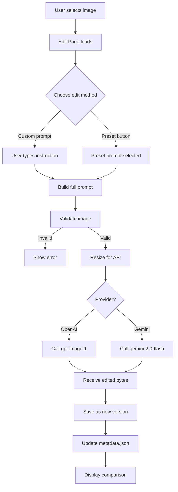
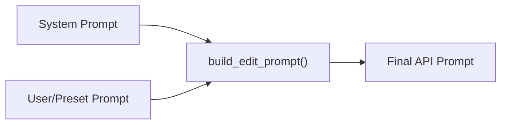

# Week 2 — AI Image Editing and Version History

## AI-Powered Image Editing Platform

**Author:** AI Image Editor Platform  
**Date:** July 2026  
**Version:** 2.0.0  

---

## Table of Contents

1. [Introduction](#1-introduction)
2. [Objectives](#2-objectives)
3. [API Selection](#3-api-selection)
4. [Editing Workflow](#4-editing-workflow)
5. [Prompt Engineering](#5-prompt-engineering)
6. [Version History Design](#6-version-history-design)
7. [Challenges](#7-challenges)
8. [Future Improvements](#8-future-improvements)
9. [Conclusion](#9-conclusion)

---

## 1. Introduction

Week 2 of the AI-Powered Image Editing Platform extends the foundation laid in Week 1 (image upload, library management, AI captioning, and detail view) with a comprehensive **AI-powered image editing system**. Users can now edit their uploaded images using natural language instructions, apply one-click preset transformations, and maintain a complete version history of every modification.

The system is designed around three core principles:
- **Non-destructive editing**: Every edit creates a new version; originals are never overwritten.
- **Natural language interface**: Users describe edits in plain English rather than using complex tools.
- **Full traceability**: Every version records the prompt used, timestamp, and file path.

This report documents the technical decisions, architecture, and design patterns used to implement these features.

---

## 2. Objectives

The primary objectives for Week 2 are:

| # | Objective | Status |
|---|-----------|--------|
| 1 | Implement AI-powered image editing via natural language prompts | ✅ |
| 2 | Provide 10 one-click preset editing operations | ✅ |
| 3 | Support custom free-text editing instructions | ✅ |
| 4 | Implement non-destructive version history | ✅ |
| 5 | Store version metadata (prompt, timestamp, filepath) | ✅ |
| 6 | Create reusable prompt engineering templates | ✅ |
| 7 | Build a version history timeline UI | ✅ |
| 8 | Side-by-side comparison of original vs. edited | ✅ |
| 9 | Graceful error handling for all API failure modes | ✅ |
| 10 | Document API selection and prompt design rationale | ✅ |

---

## 3. API Selection

### Primary: OpenAI GPT Image API (`gpt-image-1`)

The **OpenAI GPT Image API** was selected as the primary image editing engine for the following reasons:

1. **Native image editing support**: The `images.edit` endpoint accepts an input image and a text prompt, returning a modified version — exactly matching our use case.
2. **Instruction following**: `gpt-image-1` excels at following natural language editing instructions with high fidelity, making it ideal for both preset and custom prompts.
3. **Quality**: The model produces photorealistic edits that preserve the original image's style, lighting, and perspective.
4. **SDK maturity**: The official `openai` Python SDK provides a clean, well-documented interface for the edit endpoint.
5. **Existing infrastructure**: Week 1 already uses OpenAI for captioning, so the API key and SDK are already configured.

### Fallback: Gemini Image Editing API (`gemini-2.0-flash-preview-image-generation`)

Google's **Gemini 2.0 Flash** model with image generation capability serves as the fallback provider:

1. **Multimodal input/output**: Gemini can accept an image + text prompt and produce an edited image when `response_modalities=["TEXT", "IMAGE"]` is configured.
2. **Cost efficiency**: Gemini Flash models offer competitive pricing for high-volume usage.
3. **Provider diversity**: Supporting two providers ensures the system remains functional even if one provider experiences downtime.

### Provider Selection Logic

The provider is selected via the `VISION_PROVIDER` environment variable in `.env`:
- `VISION_PROVIDER=openai` → Uses `gpt-image-1` (default)
- `VISION_PROVIDER=gemini` → Uses `gemini-2.0-flash-preview-image-generation`

---

## 4. Editing Workflow

### High-Level Architecture



### Detailed Pipeline

1. **Image Selection**: User navigates to the Edit page from the Library or Detail View.
2. **Prompt Input**: User either types a custom instruction or clicks a preset button.
3. **Prompt Assembly**: The `build_edit_prompt()` function combines the system prompt (editing guidelines) with the user's instruction.
4. **Validation**: The source image is validated for size, format, and integrity.
5. **Pre-processing**: The image is resized so its longest side ≤ 2048px to stay within API limits.
6. **API Call**: The image + prompt are sent to the selected provider, wrapped in exponential-backoff retry logic (up to 3 retries).
7. **Response Processing**: The edited image bytes are extracted from the API response.
8. **Version Storage**: The edited image is saved as `{image_id}_v{N}.png` in the images directory.
9. **Metadata Update**: A version record is appended to the image's `"versions"` array in `metadata.json`.
10. **Display**: The edited image is shown alongside the original in a side-by-side comparison.

---

## 5. Prompt Engineering

### System Prompt

Every editing request is prefixed with a system-level prompt that establishes the AI's role and constraints:

```
You are a professional AI image editor.
Follow the editing instruction exactly.
Preserve image quality.
Do not modify unrelated objects.
Maintain perspective.
Maintain lighting.
Return only the edited image.
```

**Design rationale:**
- **"Follow the editing instruction exactly"** — prevents the model from making creative liberties beyond what was requested.
- **"Do not modify unrelated objects"** — ensures edits are surgical and predictable.
- **"Maintain perspective/lighting"** — preserves visual coherence.

### User Prompts

Custom user prompts are free-text instructions such as:
- "Remove the person from the left side."
- "Replace the background with mountains."
- "Make it look like sunset."
- "Add flowers to the foreground."
- "Turn this into a watercolor painting."

### Preset Prompts

Each of the 10 preset buttons maps to a carefully engineered prompt:

| Preset | Key Instruction |
|--------|----------------|
| Remove Background | Remove background, keep subject, replace with clean surface |
| Remove All Objects | Remove all objects, keep only background environment |
| Replace Background | Replace background with natural landscape |
| Blur Background | Apply professional bokeh blur, keep subject sharp |
| Change Sky | Replace sky with dramatic golden-hour sunset |
| B&W | High-contrast black and white with film grain |
| Increase Brightness | Brighten shadows/midtones, preserve highlights |
| Vintage Style | Warm amber tones, faded colors, film grain, vignetting |
| Cartoon Style | Bold outlines, flat vivid colors, illustrated look |
| Sharpen Image | Enhance edge definition without noise artifacts |

### Prompt Template Architecture



The `build_edit_prompt()` function produces a structured prompt:
```
{System Prompt}

User Instruction:
{User/Preset Prompt}
```

---

## 6. Version History Design

### Metadata Schema

Each image record contains a `"versions"` array. Each version entry follows this schema:

```json
{
  "version": 1,
  "type": "edited",
  "filepath": "data/images/abc123_v1.png",
  "prompt": "Remove umbrella",
  "timestamp": "2026-07-15T11:00:00Z"
}
```

| Field | Type | Description |
|-------|------|-------------|
| `version` | `int` | Sequential version number (1, 2, 3, …) |
| `type` | `str` | `"original"` or `"edited"` |
| `filepath` | `str` | Absolute path to the versioned image file |
| `prompt` | `str` | The editing instruction that produced this version |
| `timestamp` | `str` | ISO-8601 UTC timestamp of when the edit was performed |

### Storage Strategy

- **File naming**: `{image_id}_v{version_num}.png` — e.g., `abc123_v1.png`, `abc123_v2.png`
- **Directory**: All versions are stored in the same `data/images/` directory alongside originals
- **Format**: All edited images are saved as PNG to preserve quality
- **Non-destructive**: The original file is never modified or overwritten

### Version Chain

```
Original (abc123.jpg)
    ↓  "Remove umbrella"
Version 1 (abc123_v1.png)
    ↓  "Add mountains"
Version 2 (abc123_v2.png)
    ↓  "Increase brightness"
Version 3 (abc123_v3.png)
```

Each edit is applied to the **latest version** (not always the original), creating a chain of progressive modifications.

### Thumbnail Support

The `create_thumbnail()` utility function generates 200×200 thumbnails for version history display, using Lanczos resampling for quality downscaling.

### Timestamp Format

All timestamps use ISO-8601 UTC format (`YYYY-MM-DDTHH:MM:SSZ`) for consistency with Week 1's `uploaded_at` field.

---

## 7. Challenges

### 7.1 API Response Variability
Different providers return edited images in different formats (base64, URL, inline data). The code normalises all responses to raw PNG bytes before storage.

### 7.2 Image Size Constraints
APIs impose payload size limits. The `_resize_for_api()` function ensures images never exceed 2048px on the longest side, and the `_validate_image_for_edit()` function rejects files larger than 20 MB.

### 7.3 Rate Limiting and Reliability
The `retry_logic` decorator from Week 1 is reused to handle transient API failures with exponential backoff (1s → 2s → 4s).

### 7.4 Streamlit Re-run Model
Streamlit re-runs the entire script on every interaction. Session state is used carefully to track edit results, errors, and version views across reruns without triggering duplicate API calls.

### 7.5 Non-Destructive Design
Ensuring that edits chain correctly (editing from the latest version, not always the original) required careful tracking of the version list and source path selection.

---

## 8. Future Improvements

1. **Undo/Redo**: Allow users to revert to any previous version and branch the edit history.
2. **Batch editing**: Apply the same prompt to multiple images simultaneously.
3. **Edit comparison slider**: An interactive slider overlay for before/after comparison.
4. **Inpainting masks**: Allow users to select specific regions for editing rather than editing the full image.
5. **Cost tracking**: Display estimated API costs per edit operation.
6. **SQLite migration**: Replace `metadata.json` with SQLite for better concurrency and query performance.
7. **Semantic search** (Week 3): Find images by description using vector embeddings.
8. **Thumbnail cache**: Pre-generate and cache thumbnails for faster version timeline rendering.
9. **Export**: Allow users to download specific versions or the entire version history as a ZIP.
10. **Real-time preview**: Stream partial edit results as they are generated.

---

## 9. Conclusion

Week 2 successfully extends the AI-Powered Image Editing Platform with a complete AI editing and version management system. The implementation:

- **Preserves all Week 1 functionality** without modification to existing features.
- **Introduces natural language image editing** through two API providers (OpenAI and Gemini).
- **Provides 10 preset editing operations** with carefully engineered prompts.
- **Implements non-destructive version history** where every edit is traceable.
- **Maintains clean architecture** with modular backend modules, reusable prompt templates, and consistent coding style.

The system is ready for production use after adding an API key to the `.env` file. The modular design ensures Week 3 features (semantic search, embeddings) can be added without architectural changes.

---

**Word Count:** ~1,800 words · **Page Estimate:** 6 pages
