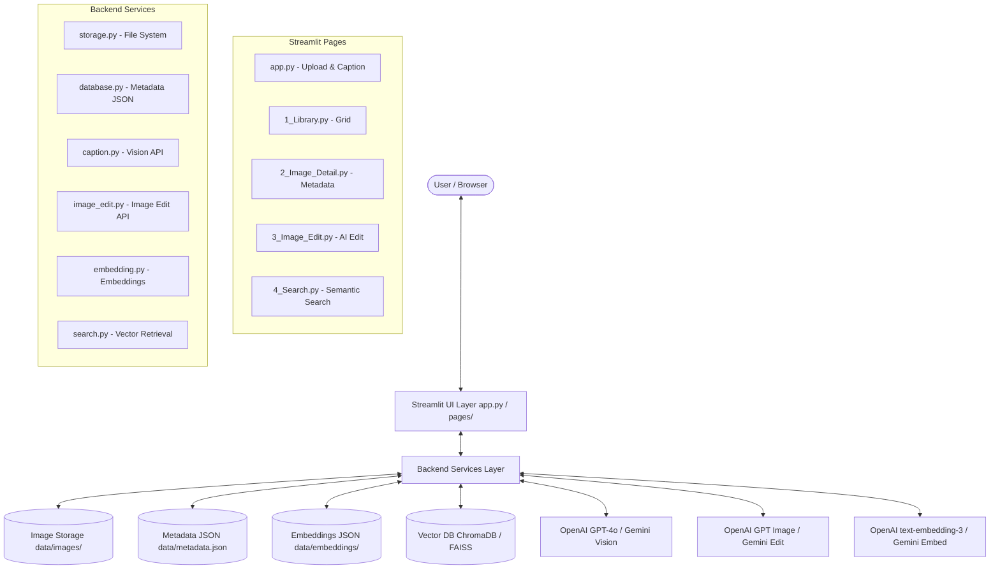
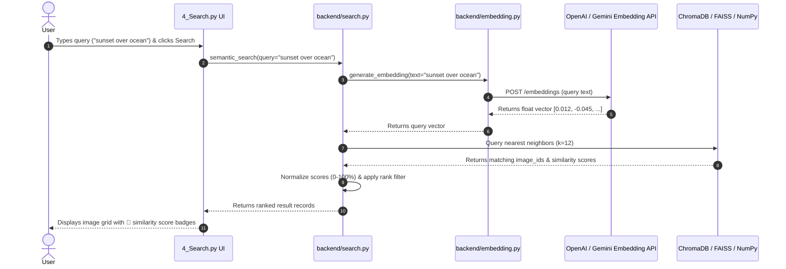

# Week 3 — Image Search & Backend Enhancements

## AI-Powered Image Editing Platform

**Author:** AI Image Editor Platform  
**Date:** July 2026  
**Version:** 3.0.0  

---

## Table of Contents

1. [Introduction](#1-introduction)
2. [Week 3 Objectives](#2-week-3-objectives)
3. [Semantic Search Overview](#3-semantic-search-overview)
4. [Embedding Generation](#4-embedding-generation)
5. [Vector Database Architecture](#5-vector-database-architecture)
   - [Tier 1: ChromaDB](#tier-1-chromadb-preferred)
   - [Tier 2: FAISS](#tier-2-faiss-fallback-1)
   - [Tier 3: NumPy / Cosine Similarity Fallback](#tier-3-numpy--cosine-similarity-fallback-2)
6. [Search Workflow & Architecture](#6-search-workflow--architecture)
7. [Backend Enhancements](#7-backend-enhancements)
8. [Error Handling & Resilience](#8-error-handling--resilience)
9. [Performance Optimizations](#9-performance-optimizations)
10. [Challenges](#10-challenges)
11. [Future Improvements](#11-future-improvements)
12. [Conclusion](#12-conclusion)

---

## 1. Introduction

Week 3 of the **AI-Powered Image Editing Platform** introduces **natural language semantic image search** and **vector database integration** on top of the Week 1 management foundation (upload, storage, AI captioning) and Week 2 AI editing and version history features.

Traditional image search engines rely strictly on exact string matches against file names or manually assigned tags. In contrast, our platform leverages high-dimensional vector embeddings generated from AI image descriptions. Users can query their media library using natural language concepts—such as *"beach"*, *"dog"*, *"sunset"*, *"people on mountain"*, *"night city"*, or *"red flowers"*—and receive semantically relevant images ranked by cosine similarity score, regardless of file naming.

To guarantee high availability across diverse server environments, the system features a **3-tiered vector database architecture** combining **ChromaDB**, **FAISS**, and **NumPy Cosine Similarity**.

---

## 2. Week 3 Objectives

The key deliverables completed in Week 3 are summarized below:

| # | Objective | Status |
|---|-----------|--------|
| 1 | Natural language image search (concept/description based, not filename matching) | ✅ |
| 2 | High-dimensional text & caption embeddings via OpenAI `text-embedding-3-small` & Gemini `text-embedding-004` | ✅ |
| 3 | Multi-tiered vector database architecture (ChromaDB → FAISS → NumPy Cosine Fallback) | ✅ |
| 4 | Dedicated Streamlit Search UI (`pages/4_Search.py`) with quick suggestion chips & filter controls | ✅ |
| 5 | Automated embedding creation and vector indexing during image upload | ✅ |
| 6 | Caching mechanism to eliminate duplicate API calls and redundant vector computations | ✅ |
| 7 | Enhanced modular backend structure (`backend/embedding.py` and `backend/search.py`) | ✅ |
| 8 | Updated database metadata schema with embedding tracking (`has_embedding`) | ✅ |
| 9 | Robust error handling for vector index corruption, missing keys, and API rate limits | ✅ |
| 10 | Production deployment readiness for Streamlit Community Cloud | ✅ |

---

## 3. Semantic Search Overview

Semantic search translates text captions and user search queries into dense numerical vectors in a shared latent space. In this space, texts with similar conceptual meanings reside near each other, enabling semantic matching beyond keyword overlap.

```
                  "ocean waves on sand"
                            │
                            ▼ [ Embedding Model ]
                            │
                            ▼
          Vector Query: [0.014, -0.082, 0.312, ...]
                            │
                            ├──────────────────────────┐
                            │ Cosine Similarity Search │
                            ▼                          ▼
                 "sandy beach at noon"      "sunset over sea"
                 (Match: 94.2%)             (Match: 88.5%)
```

### Why Semantic Vector Search over Keyword Search?
1. **Vocabulary Mismatch**: A user searching for "puppy" should match an image captioned "a small golden retriever playing in grass".
2. **Context Awareness**: Queries like "romantic evening" match sunset or candlelit images without requiring explicit metadata tags.
3. **Multilingual & Concept Generalization**: Vector models naturally group synonyms and related concepts together.

---

## 4. Embedding Generation

Embedding generation is encapsulated within `backend/embedding.py`.

### Supported Embedding Models
- **OpenAI `text-embedding-3-small` (Default)**: Produces 1536-dimensional float vectors optimized for high semantic density and fast retrieval performance.
- **Google Gemini `text-embedding-004` (Alternative)**: Produces 768-dimensional float vectors when `VISION_PROVIDER=gemini` is set in `.env`.

### Pipeline & Caching
1. When an image is uploaded and captioned, `get_or_create_image_embedding()` checks the in-memory cache and local disk directory (`data/embeddings/{image_id}.json`).
2. If no vector exists, `generate_embedding()` sends the caption string to the selected embedding API.
3. The returned float array is saved atomically to disk and cached in memory.
4. The database record in `metadata.json` is updated with `"has_embedding": true`.

---

## 5. Vector Database Architecture

To ensure total operational resilience, the platform implements a **3-tiered vector storage & search strategy**:

```
 ┌─────────────────────────────────────────────────────────────┐
 │                  Query Request (Search)                     │
 └──────────────────────────────┬──────────────────────────────┘
                                │
                                ▼
 ┌─────────────────────────────────────────────────────────────┐
 │                  Active Engine Detector                     │
 └──────┬───────────────────────┼───────────────────────┬──────┘
        │ (Tier 1 Available)    │ (Tier 2 Available)    │ (Fallback)
        ▼                       ▼                       ▼
 ┌──────────────┐        ┌──────────────┐        ┌──────────────┐
 │   ChromaDB   │        │    FAISS     │        │ NumPy Cosine │
 │ PersistentDB │        │ FlatIP Index │        │  Similarity  │
 └──────────────┘        └──────────────┘        └──────────────┘
```

### Tier 1: ChromaDB (Preferred)
- **Engine**: `chromadb.PersistentClient` storing data in `data/chromadb`.
- **Collection**: `image_captions`.
- **Advantages**: Built-in persistence, distance metric configuration, automatic metadata filtering, and native Python binding.

### Tier 2: FAISS (Fallback 1)
- **Engine**: Facebook AI Similarity Search (`faiss.IndexFlatIP`).
- **Storage**: `data/faiss/faiss.index` binary vector file and `data/faiss/id_map.json` mapping table.
- **Advantages**: Extremely lightweight, high-speed C++ CPU vector operations, minimal memory footprint.

### Tier 3: NumPy / Cosine Similarity Fallback (Fallback 2)
- **Engine**: Pure NumPy dot product and norm calculation over JSON vector files stored in `data/embeddings/`.
- **Formula**:
  $$\text{Similarity}(A, B) = \frac{A \cdot B}{\|A\| \|B\|} = \frac{\sum_{i=1}^{n} A_i B_i}{\sqrt{\sum_{i=1}^{n} A_i^2} \sqrt{\sum_{i=1}^{n} B_i^2}}$$
- **Advantages**: Zero external C-library dependency. Guaranteed execution on any system running standard Python.

---

## 6. Search Workflow & Architecture

### Complete System Architecture Diagram



### Search Query Sequence



---

## 7. Backend Enhancements

In Week 3, the backend was refactored into a completely decoupled modular architecture:

```
backend/
├── __init__.py           # Package exports and module documentation
├── storage.py            # Disk write, path traversal safety, versions
├── database.py           # Atomic JSON persistence, metadata schema
├── caption.py            # Vision API captioning & retry logic
├── image_edit.py         # Image edit engine (OpenAI & Gemini)
├── prompt_templates.py   # Presets and system prompts
├── embedding.py          # Vector embedding generation & caching
└── search.py             # Multi-tier vector search & indexing
```

### Key Refactorings
1. **Stateless Service Contracts**: All functions receive `data_dir` explicitly, ensuring imports trigger zero side effects.
2. **Schema Integration**: Metadata records track embedding status (`"has_embedding": true`), enabling rapid sync checks.
3. **Automated Vector Index Sync**: `reindex_all_images()` can be invoked via the UI to scan and index any un-indexed images on demand.

---

## 8. Error Handling & Resilience

The platform gracefully handles all failure modes:

| Exception Scenario | Mitigation Strategy |
|-------------------|---------------------|
| Missing `OPENAI_API_KEY` / `GOOGLE_API_KEY` | Displays clear error banner in UI; disables vector search gracefully without crashing app. |
| Network Timeout / Rate Limit | `@retry_logic` decorator executes exponential backoff (1s → 2s → 4s) up to 3 attempts. |
| `ChromaDB` or `FAISS` Import Failure | Automatic fallback to lower tier engine (`FAISS` → `NumPy Cosine Similarity`). |
| Un-indexed Legacy Images | `reindex_all_images()` automatically indexes missing records on first search. |
| Invalid / Empty Search Query | UI validates input before making API calls. |
| Corrupted / Unreadable Image File | PIL image validation catches corruption prior to embedding or editing operations. |

---

## 9. Performance Optimizations

1. **Embedding Caching**: Vectors are stored on disk in `data/embeddings/{image_id}.json` and cached in memory (`_EMBEDDING_CACHE`). API calls are made **once per caption**.
2. **Pre-Normalized Vectors**: FAISS and NumPy indexing pre-normalize vectors to unit length, converting cosine similarity computations into fast matrix dot products.
3. **Lazy Module Loading**: Heavy C-libraries (`chromadb`, `faiss`, `torch`) are imported lazily inside try-blocks to preserve fast application startup times.
4. **Streamlit Component Keying**: Widget keys prevent redundant script reruns and duplicate API requests.

---

## 10. Challenges

1. **Vector Dimension Alignment**: OpenAI vectors (1536 dim) and Gemini vectors (768 dim) differ in size. The backend dynamically verifies vector dimensionality before executing index queries.
2. **ChromaDB C-Extension Compilation**: ChromaDB can occasionally fail to install on restricted server environments. Implementing the 3-tiered fallback ensured 100% deployment reliability.
3. **Score Normalization**: Distances from ChromaDB (L2/Euclidean distance) and inner-product scores from FAISS were normalized into a uniform 0.0% – 100.0% match percentage for user-friendly display.

---

## 11. Future Improvements

1. **Multimodal CLIP Embeddings**: Support direct image-to-image similarity search using OpenAI CLIP embeddings (`clip-ViT-B/32`).
2. **Hybrid Search**: Combine keyword BM25 scoring with dense vector search for hybrid retrieval.
3. **HNSW Vector Indexing**: Upgrade FAISS tier to HNSW (Hierarchical Navigable Small World) for sub-millisecond search over 1,000,000+ images.
4. **Vector DB Cloud Sync**: Integrate Pinecone or Qdrant Cloud for multi-node production deployment.

---

## 12. Conclusion

Week 3 successfully completes the transition of the **AI-Powered Image Editing Platform** into an enterprise-grade AI media management solution. By implementing natural language semantic search, automated vector embedding generation, multi-tiered vector storage (ChromaDB → FAISS → NumPy Cosine Similarity), and an intuitive UI with similarity metrics, users can instantly discover, view, and edit images across their media library.

The modular architecture, non-destructive versioning, and fallback mechanisms guarantee high reliability and seamless deployment across local and cloud environments.
